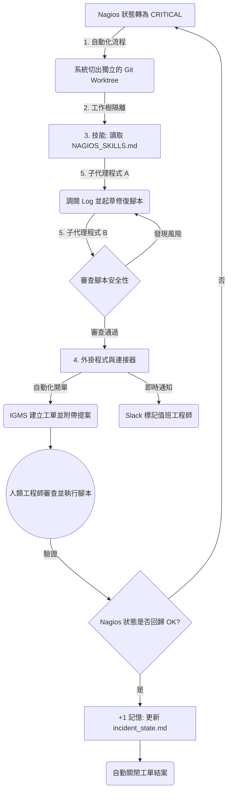

# 人機協同迴圈工程：流程圖與核心要素

本文件整理並說明如何以 **Nagios 監控告警** 為實際案例，實踐「人機協同迴圈（Human-in-the-Loop）」的自動化修復與決策關閉流程。

---

## 系統流程圖

---

## 5+1 核心組成部分與監控場景對應

根據人機協同迴圈工程的定義，一個完整的運作 Loop 需要 **5 個核心元素**，加上 **1 個用於持久化儲存記憶的空間**。以下為這 6 個元素在「Nagios 人機協同系統」中的具體實踐與應用說明：

### 1. 自動化流程 (Automation)
* **核心概念**：系統應按排程或事件觸發執行，自動進行狀態探索、分類與後續驗證。
* **Nagios 實踐**：
  * **主動監控與異常觸發**：充當系統的「心跳與觸發器」。無需等待人工排程，當服務發生異常時，Nagios 的 Event Handlers（事件處理器）會在第一時間自動呼叫 AI 代理程式。
  * **自動化驗證**：在人類工程師執行完修復動作後，Nagios 的下一次檢查（Check）亦是自動化流程的一部分，負責自動驗證修復結果是否成功。

### 2. 工作樹 (Worktrees)
* **核心概念**：提供一個獨立分支的單獨工作目錄，確保多個代理程式同時工作時不會互相干擾。
* **Nagios 實踐**：
  * **安全的實驗沙盒**：當 AI 代理程式調閱資料或嘗試撰寫修復腳本時，必須在自動切出的隔離 Git Worktree 中進行。這確保了 AI 在分析與測試語法時，絕對不會干擾到正式生產環境的設定檔。

### 3. 技能 (Skills)
* **核心概念**：記錄專案與領域的知識。若沒有技能設定，代理程式在每個週期都必須從零開始重新推導與猜測。
* **Nagios 實踐**：
  * **團隊維運知識庫**：這是一份名為 `NAGIOS_SKILLS.md` 的「團隊維運守則」。裡面記錄了人類工程師累積的基礎設施慣例（例如：「遇到資料庫連線滿載時，只能 Kill 卡住的報表 Thread，嚴禁重啟服務」）。AI 必須閱讀此檔案才能產出符合團隊規範的修復提案。

### 4. 外掛程式與連接器 (Connectors)
* **核心概念**：將代理程式連接到現有的工具鏈。連接器讓 Loop 能在實際環境中採取行動，而非僅停留在建議階段。
* **Nagios 實踐**：
  * **AI 的手與眼**：透過連接器，AI 可以讀取 Nagios API、透過 SSH 登入伺服器查看 Log。當修復提案通過內部稽核後，連接器能直接與工單系統（如 IGMS）對接建立工單，並同步發送通知至 Slack 標記值班工程師。

### 5. 子代理程式 (Sub-agents)
* **核心概念**：建立「創造者」與「檢查者」的分權審查機制，由一個代理程式提出想法，另一個進行安全性與合規性檢查。
* **Nagios 實踐**：
  * **工單送出前的雙重稽核**：
    * **調查與編寫者（Agent A）**：負責在第一時間翻閱 Log、在獨立的 Worktree 中起草建議的修復腳本。
    * **審查與驗證者（Agent B）**：扮演資安與維運專家，嚴格審查 Agent A 產出的腳本是否包含後門、安全漏洞或誤刪資料的風險。只有當 Agent B 審查通過，提案才會真正送出。

---

### +1. 記憶 (Memory)
* **核心概念**：LLM 模型在不同的執行週期之間會遺忘所有上下文，因此關鍵狀態與歷史記錄必須保存在硬碟（磁碟）中。
* **Nagios 實踐**：
  * **狀態追蹤與防無窮迴圈**：系統會維護一份 `incident_state.md` 檔案，記錄特定主機的告警歷史與已經嘗試過的修復動作。當 Nagios 確認服務恢復正常時，系統會更新此記憶檔案。這除了用於結案，也能避免未來再度發生相同問題時，AI 陷入重試相同失敗動作的無窮迴圈。